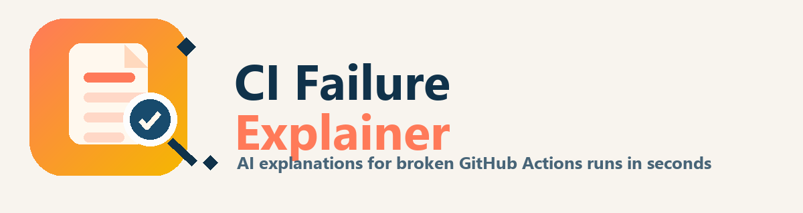
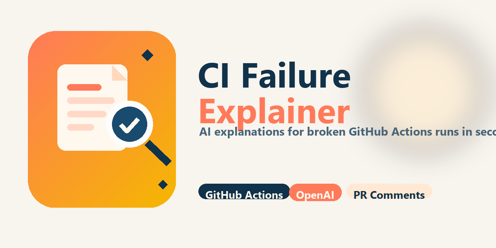

# CI Failure Explainer

<p align="center">
  
</p>

<p align="center">
  
  
  
  
</p>

<h3 align="center">Stop reading CI logs. Let AI explain the failure.</h3>

<p align="center">
  CI Failure Explainer analyzes failed GitHub Actions jobs, downloads the relevant logs, and uses AI to generate a concise explanation of what went wrong and how to fix it.
</p>

<p align="center">
  <strong>Short summary</strong> • <strong>Root cause</strong> • <strong>Fix steps</strong> • <strong>Confidence estimate</strong>
</p>

<p align="center">
  The explanation is automatically posted as a pull request comment or a workflow job summary.
</p>

<table>
  <tr>
    <th>Product Preview</th>
    <th>Example Output</th>
  </tr>
  <tr>
    <td width="56%">
      
    </td>
    <td>
      <pre lang="md">CI Failure Explainer

Workflow: CI
Analysis Status: success

Failed Jobs
- test (Step 3: npm test)

Short Summary
The CI job failed because a dependency was missing during the test step.

Likely Root Cause
The project attempted to run tests before installing dependencies.

Specific Fix Steps
1. Ensure `npm ci` runs before `npm test`
2. Verify `package.json` includes all required dependencies
3. Re-run the workflow

Confidence Level
medium</pre>
    </td>
  </tr>
</table>

<p align="center">
  <sub>Logs may be truncated for analysis.</sub>
</p>

## Use In 1 Minute

Add a dedicated follow-up job to your workflow and let CI Failure Explainer comment on failed runs automatically.

```yaml
explain-failure:
  if: ${{ failure() }}
  needs:
    - test
  runs-on: ubuntu-latest
  permissions:
    actions: read
    contents: read
    pull-requests: write
    issues: write
  steps:
    - name: Explain CI failure
      uses: your-org/ci-failure-explainer@v1
      with:
        github-token: ${{ secrets.GITHUB_TOKEN }}
        openai-api-key: ${{ secrets.OPENAI_API_KEY }}
        model: gpt-4.1-mini
```

Copy the snippet, add your job dependencies under `needs:`, and run it in the same workflow as your CI jobs.

## How It Works

1. Detect failed jobs in the current workflow run
2. Download job logs using the GitHub Actions API
3. Sanitize logs and remove secrets
4. Truncate logs to a safe size
5. Send logs to OpenAI for analysis
6. Post a structured explanation as a PR comment or job summary

## Features

- Detects failed jobs in the current workflow run attempt
- Downloads failed job logs with the GitHub REST API
- Redacts obvious secrets and trims logs to a prompt-safe size
- Focuses AI analysis on the first failing step
- Returns a short summary, likely root cause, fix steps, and confidence level
- Falls back to a deterministic explanation if the OpenAI API call fails
- Skips AI analysis cleanly when fork pull requests do not have access to secrets
- Updates an existing PR comment instead of spamming duplicates
- Always writes a GitHub Actions job summary

## Why Use CI Failure Explainer?

CI failures often require digging through thousands of lines of logs.

This action automatically:

- Identifies the failing job
- Extracts the most relevant log sections
- Removes secrets and sensitive tokens
- Generates a concise explanation using AI

Developers can understand CI failures in seconds instead of minutes.

## Inputs

| Name | Required | Default | Description |
| --- | --- | --- | --- |
| `github-token` | Yes | | Token used to read workflow jobs/logs and post PR comments |
| `openai-api-key` | No | | OpenAI API key. If omitted, AI analysis is skipped |
| `model` | No | `gpt-4.1-mini` | OpenAI model name |

## Outputs

| Name | Description |
| --- | --- |
| `analysis-status` | `success`, `fallback`, or `skipped` |
| `failed-job-count` | Number of failed jobs detected in the current workflow run |
| `pull-request-commented` | `true` if the action posted or updated a PR comment |

## Recommended Workflow

Use this action in a dedicated follow-up job with `if: failure()`. That pattern gives the action a stable set of completed failed jobs to inspect and avoids racing the jobs that actually failed.

```yaml
name: CI

on:
  pull_request:
  push:

jobs:
  test:
    runs-on: ubuntu-latest
    steps:
      - uses: actions/checkout@v4
      - run: npm ci
      - run: npm test

  explain-failure:
    if: ${{ failure() }}
    needs:
      - test
    runs-on: ubuntu-latest
    permissions:
      actions: read
      contents: read
      pull-requests: write
      issues: write
    steps:
      - name: Explain CI failure
        uses: your-org/ci-failure-explainer@v1
        with:
          github-token: ${{ secrets.GITHUB_TOKEN }}
          openai-api-key: ${{ secrets.OPENAI_API_KEY }}
          model: gpt-4.1-mini
```

## Permissions

- `actions: read` is required to enumerate jobs and download logs
- `pull-requests: write` and `issues: write` are recommended for PR comments
- `contents: read` is recommended for standard workflow execution parity

Recommended workflow permissions:

```yaml
permissions:
  actions: read
  contents: read
  pull-requests: write
  issues: write
```

If `pull-requests: write` is missing or the run is not attached to a PR, the action still writes the explanation to the job summary.

## Fork Pull Requests

For `pull_request` events that come from forks, GitHub does not expose repository secrets such as `OPENAI_API_KEY`. In that case this action:

- Detects the forked PR context
- Skips the OpenAI call instead of failing
- Writes a job summary explaining why AI analysis was skipped
- Avoids treating the missing secret as an action failure

If you need AI analysis on forked contributions, use a carefully reviewed `pull_request_target` design and understand the security tradeoffs before exposing any secrets.

## OpenAI Usage

This action sends sanitized and truncated log excerpts to OpenAI for analysis.

Typical requests are small, with prompt input capped at roughly 120 KB of logs and responses capped at 300 tokens.

This keeps OpenAI usage inexpensive while still providing useful explanations.

If the OpenAI API call fails, the action still runs and produces a fallback explanation. If the OpenAI API key is not provided, the action skips AI analysis gracefully and writes a summary explaining why.

## Roadmap

Planned improvements:

- Slack notifications for CI failures
- GitHub Checks integration
- Historical failure insights
- CI failure pattern detection

## Local Development

Install dependencies and build the bundled action:

```bash
npm install
npm run verify
```

The TypeScript config keeps `outDir` separate from the published bundle, and `npm run build` uses `ncc` to generate the single-file `dist/index.js` artifact that `action.yml` executes.

## Publishing And Releases

GitHub Actions should be published with the built bundle checked in. Before cutting a tag or release:

1. Run `npm run verify`
2. Commit the updated `dist/index.js`, `dist/index.js.map`, and `dist/licenses.txt`
3. Tag the release that consumers will reference in `uses:`

## Notes

- The action analyzes failed jobs for the current workflow run attempt, not arbitrary historical runs.
- Large logs are sanitized, secret-redacted, and truncated before they are sent to OpenAI.
- The action expects the OpenAI API to return JSON, normalizes the confidence level to `low`, `medium`, or `high`, and falls back when the API is unavailable.
